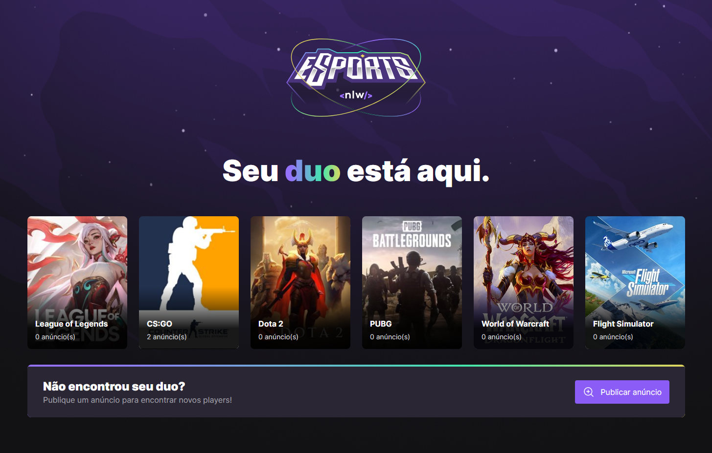
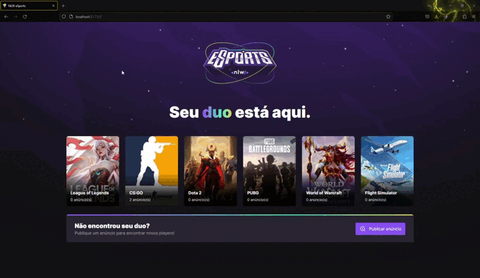

<h1 align="center">E-sports</h1>
<h3 align="center">
  
  
  
  
  
</h3>
<h3>💻 Sobre: </h3>

Esse projeto foi desenvolvido durante uma Next Level Week, disponibilizado pela RocketSeat. O projeto consiste em publicar anúncio para encontrar um duo para sua jogatina online, selecionando o jogo e criando o anúncio.

<h3>🛠 Tecnologias utilizadas: </h3>
<ul>
  <li>Typescript</li>
  <li>ReactJS</li>
  <li>React Native</li>
  <li>Vite</li>
  <li>Tailwind CSS</li>
  <li>Phosphor-icons</li>
  <li>Radix UI</li>
  <li>NodeJS</li>
  <li>Prisma</li>
  <li>Express</li>
  
</ul

<h3>📟 Layout da aplicação:</h3>
  
  
  
<h3>⚙️ Instalação: </h3>

    # Clone o repositório
    $ git clone <https://github.com/Lenondiedrich/nlw-esports>

    <h3>Backend</h3>
    # Navegue até o diretório server
    $ cd server

    # Instale as dependências da aplicação
    $ npm install ou yarn

    # Inicie a aplicação React
    $ npm start ou yarn start

    <h3>Frontend</h3>
    # Navegue até o diretório web
    $ cd web

    # Instale as dependências da aplicação
    $ npm install ou yarn

    # Inicie a aplicação React
    $ npm start ou yarn start

A aplicação irá rodar no endereço `http://localhost:5173`

<h3>📝 Licença</h3>

Este projeto está sob a licença do MIT

